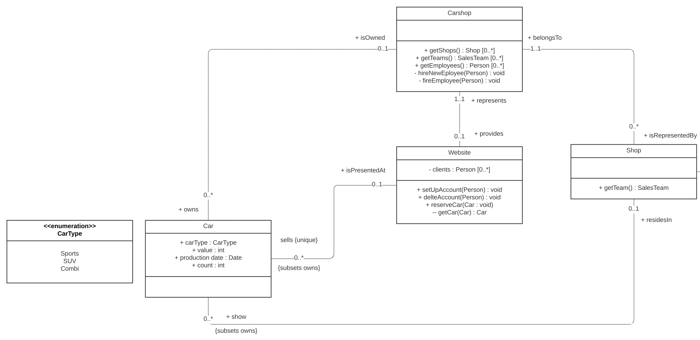
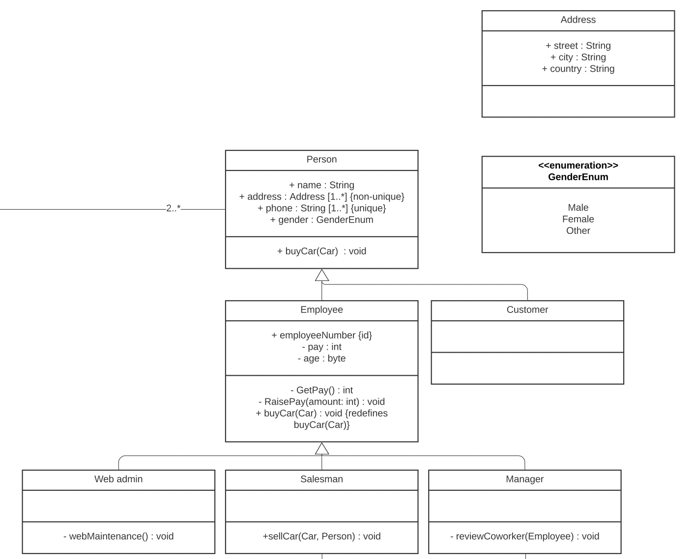
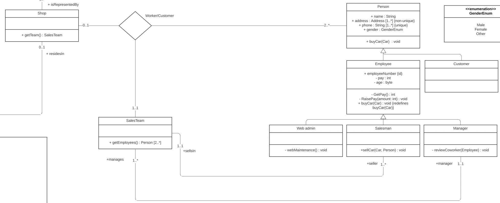

# CarShop_UML-OCL

## Overview
UML model showed in [model.pdf](model.pdf) describes simple car shop. Every car shop has at least one brick and mortar shop or website. Car shop may consist of several cars they sell - either through website or in the shop. Every carshop has exactly one salesteam which is formed of one manager and at least one salesman.

## Documentation
This part describes several parts of whole model.

### CarShop

`Carshop` has several relations:
- 0 to many cars (represented by `Car` class)
- 0 to 1 websites (represented by `Website` class)
- 0 to many shops (represented by `Shop` class)

Each carshop has at least one shop or website. This is expressed by following OCL expression:
```
context Carshop
inv: self.isRepresentedBy->size() > 0 or self.provides->size() > 0
```
Throug a website, user can reserve a concrete car. 
After reserving a specific car, its count is decreased by one. This is ensured by next OCL expression:
```
context Website::reserveCar(c:Car) : void
pre self.sells->select(c2| c2 = c)->size() > 0 and self.getCar(c)->count >= 1 post if (c.count@pre = 1)
then self.sells->select(c2| c2 = c)->isEmpty() else c.count = c.count@pre - 1
```

### Person

To represent several people in our model, we created a `Person` class. Using generalization, we can say there are 2 types of people - employees and customers (represented by `Employee` and `Customer` classes respectively). We then divide `Employee` class into 3 more subclasses - `Web admin`, `Salesman` and `Manager`.

Using OCL expression we restrict employees to be at least 18 years old:
```
context  Employee
inv: self.age >= 18
```

### Associations

We have one n-ary association between `Shop`, `SalesTeam` and `Person`. Each salesteam consists of at least 2 persons from which exactly one is the manager. The "exactly one manager" part is ensured by the following OCL expression: 
```
context Carshop
inv:  self.isRepresentedBy->forAll(shop| 
		shop->getEmployees()->iterate(
            v; acc : int = 0 | if (v.oclIsTypeOf(Manager))
					           then acc + 1 else acc
                                     ) = 1
		)
```
